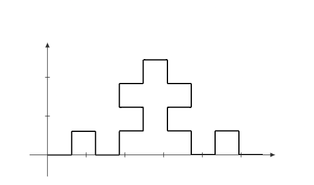

# چالش بخش تمرین درس مبانی برنامه سازی
> [@habibz](https://t.me/habibz) علیرضا حبیب زاده `99109393`

## 1. کتاب آموزش اعداد

علی که از درآمد دستیاری تدریس ناراضی است تصمیم گرفت تا کتابی در زمینه‌ی کودکان منتشر کند تا با فروش آن ثروتمند شود و از دانشگاه انصراف دهد. او که بویی از ادبیات و داستان‌نویسی نبرده است تصمیم می‌گیرد تا کتاب «آموزش اعداد با وصل کردن نقاط» چاپ کند. اما ناشر برای آن که در بازار پررقابت کتاب‌های «آموزش اعداد با وصل کردن نقاط» بتواند فروش خوبی داشته باشد از علی می‌خواهد تا در کتاب از اشکالی به صورت فرکتال استفاده کند تا تیم بازاریابی بتوانند کتاب را به عنوان کتاب علمی به مردم غالب کنند. حال تیم فنی ناشر از علی می‌خواهد تا با گرفتن عرض کل فرکتال و مرتبه‌ی آن، مختصات نقاط را به ترتیب در اختیارشان قرار دهد.


### برنامه
با توجه به الگوی زیر در فرکتال‌ها برنامه‌ای بنویسید که با گرفتن n (مرتبه‌ی فرکتال) و l (عرض کل فرکتال) مختصات نقاطی را بدهد که کودک با وصل کردن آن‌ها به شکل کامل برسد. فرض کنید نقطه‌ی شروع همیشه سمت چپ فرکتال و مبدا مختصات `(0 0)` است.


*n = 0*


*n = 1*


*n = 2*


*n = 3*


*n = 4*




### ورودی
در یک خط به ترتیب عدد صحیح n و عدد اعشاری l.


$$n < 10^9$$

$$10^{-1} < l < 10^9$$

### خروجی
مختصات نقاط به ترتیب در خط‌های جدا به صورت `x y` با دو رقم اعشار دقت.  

### مثال
ورودی
```
1 1
```

خروجی
```
0.00 0.00
0.33 0.00
0.33 0.33
0.67 0.33
0.67 0.00
1.00 0.00
```

ورودی
```
2 20
```

خروجی
```
0.00 0.00
2.22 0.00
2.22 2.22
4.44 2.22
4.44 0.00
6.67 0.00
6.67 2.22
8.89 2.22
8.89 4.44
6.67 4.44
6.67 6.67
8.89 6.67
8.89 8.89
11.11 8.89
11.11 6.67
13.33 6.67
13.33 4.44
11.11 4.44
11.11 2.22
13.33 2.22
13.33 0.00
15.56 0.00
15.56 2.22
17.78 2.22
17.78 0.00
20.00 0.00
```

### پیاده‌سازی
(کد کنار pdf پیوست شده و صرفا برای راحتی اینجا هم آورده شده و طبعا جزو سوال نیست.)

```c
#include <stdio.h>

double x, y;
int angle;

void print_coordinates() {
    // x and y are positive but small rounding error can make them negative
    // (e.g. -0.00001 -> -0.00) this will fix the problem:
    x = x >= 0 ? x : -x;
    y = y >= 0 ? y : -y;
    printf("%.2lf %.2lf\n", x, y);
}

void forward(double l) {
    angle = (angle % 4 + 4) % 4;
    switch (angle) {
        case 0:
            x += l;
            break;
        case 1:
            y += l;
            break;
        case 2:
            x -= l;
            break;
        case 3:
            y -= l;
            break;
    }
    print_coordinates();
}

void draw_left(int n, double l);
void draw_right(int n, double l);

int main() {
    int n;
    double l;
    scanf("%d %lf", &n, &l);
    x = 0;
    y = 0;
    angle = 0;

    print_coordinates();
    draw_left(n, l);

    return 0;
}

void draw_left(int n, double l) {
    if (n == 0) {
        forward(l);
        return;
    }
    draw_left(n - 1, l / 3);
    angle++;
    draw_right(n - 1, l / 3);
    angle--;
    draw_left(n - 1, l / 3);
    angle--;
    draw_right(n - 1, l / 3);
    angle++;
    draw_left(n - 1, l / 3);
}

void draw_right(int n, double l) {
    if (n == 0) {
        forward(l);
        return;
    }
    draw_right(n - 1, l / 3);
    angle--;
    draw_left(n - 1, l / 3);
    angle++;
    draw_right(n - 1, l / 3);
    angle++;
    draw_left(n - 1, l / 3);
    angle--;
    draw_right(n - 1, l / 3);
}

```


## 2. قورقوری


قورقوری قورباغه‌ای سه‌چشمی است که در فضایی دوبعدی زندگی می‌کند و دنیا را به صورت اعداد صحیح می‌بیند. دنیای اطراف قورقوری آرایه‌ای n عضوی از اعداد است. قورقوری به هر نقطه از آرایه که نگاه می‌کند آنجا را به صورت جمع وزن‌دار آنجا و دو نقطه‌ی اطرافش می‌بیند. حال شما باید با گرفتن آرایه‌ی دنیای اطراف قورباغه آن را از دید او شبیه‌سازی کنید. دنیای بیرون لبه‌ی آرایه را صفر فرض کنید.


### ورودی
در خط اول سه ضریب چشم قورقوری و در خط بعد n اندازه‌ی آرایه و سپس در n خط بعدی به ترتیب n عضو آرایه به شما داده می‌شود.


$$n < 10000$$

$$a_i < 10^9$$

### خروجی
در n خط آرایه را از دید قورقوری چاپ کنید.

### مثال
ورودی
```
1 0 1
5
1
2
3
4
5
```

خروجی
```
2
4
6
8
4
```

ورودی
```
-1 2 -1
4
3
3
3
3
3
0
0
3
```

خروجی
```
3
0
0
3
```

(برای سخت‌تر شدن سوال می‌توان n چشمی در نظر گرفت)


### پیاده‌سازی

```c
#include <stdio.h>


int main() {
    int n = 10;
    int a[n + 2];
    int b0, b1, b2;

    scanf("%d %d %d", &b0, &b1, &b2);
    scanf("%d", &n);

    a[0] = 0;
    for (int i = 0; i < n; i++) {
        scanf("%d", &a[i + 1]);
    }
    a[n + 1] = 0;

    for (int i = 0; i < n; i++) {
        printf("%d\n", a[i] * b0 + a[i + 1] * b1 + a[i + 2] * b2);
    }
    
    return 0;
}

```
